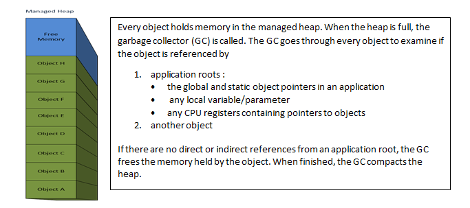
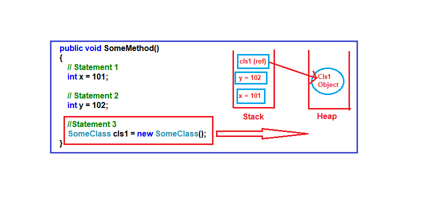

# .NET FUNDAMENTALS

## CLR Architecture

A diagram that demonstrates the architecture of Common Language Runtime is given as follows

 - **Base Class Library Support**: The Common Language Runtime provides support for the base class library.

 - **Thread Support**: The CLR provides thread support for managing the parallel execution of multiple threads. The System.Threading class is used as the base class for this.

 - **COM Marshaller**: Communication with the COM (Component Object Model) component in the .NET application is provided using the COM marshaller.

 - **Type Checker**: Type safety is provided by the type checker by using the Common Type System (CTS) and the Common Language Specification (CLS) that are provided in the CLR to verify the types that are used in an application.

 - **Exception Manager**: The exception manager in the CLR handles the exceptions regardless of the .NET Language that created them. 

 - **Security Engine**: The security engine in the CLR handles the security permissions at various levels such as the code level, folder level, and machine level.

 - **Debug Engine**: An application can be debugged during the run-time using the debug engine.

 - **JIT Compiler**: The JIT compiler in the CLR converts the Microsoft Intermediate Language (MSIL) into the machine code that is specific to the computer environment that the JIT compiler runs on.

 - **Garbage Collector**: Automatic memory management is made possible using the garbage collector in CLR.

 - **CLR Loader**: Various modules, resources, assemblies, etc. 
are loaded by the CLR loader.

## .NET Memory layout

Every program needs memory. Unfortunately, memory is finite. This is why modern managed environments (.NET, Erlang, and many more) implement automatic memory management with garbage collection.

Garbage Collector (GC) is the part of the .NET framework that allocates and releases memory for your .NET applications. At any moment in time object layout in memory can be presented like following

When there is not enough memoty to allocate for new objects GC releases object and compacts memory.

Basic flow of a .NET programm is execution of instructions writen in IL. To manage program flow CLR uses STACK memory that contains variables, parameters and pointers to executing methods.

